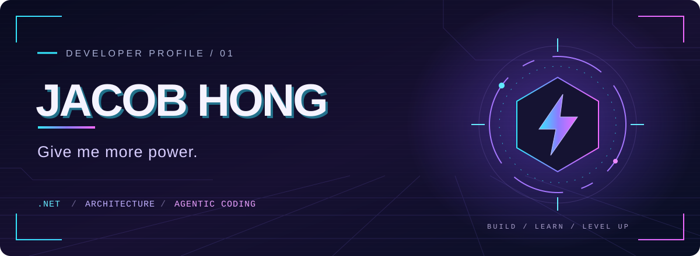

# Jacob Hong

**C# / .NET Developer** · 持續探索架構設計與 AI 協作開發

<samp>BUILD. LEARN. LEVEL UP.</samp>

  

[探索我的 skills ↗](https://github.com/GUOJIE526/skills)

 

### `01 / TECH STACK`

從應用邏輯到資料存取，我的日常技術組合。

**`C#`　`ASP.NET Core`　`Entity Framework Core`　`SQL Server`**

 

### `02 / NEXT LEVEL`

持續學習，讓設計思考與開發方式一起升級。

| 探索方向 | 學習焦點 |
| :--- | :--- |
| **Clean Architecture** | 職責邊界與依賴方向 |
| **Domain-Driven Design** | 領域語言與業務模型 |
| **Specification-Driven Development** | 從明確規格走向實作 |
| **Agentic Coding** | 探索與 AI agents 協作的開發方式 |

 

### `03 / THE WORKSHOP`

#### [skills ↗](https://github.com/GUOJIE526/skills)

持續隨著學習與實作擴增的 skills 專案。

 

---

  <samp>MORE CURIOSITY. MORE CODE. MORE POWER.</samp>

