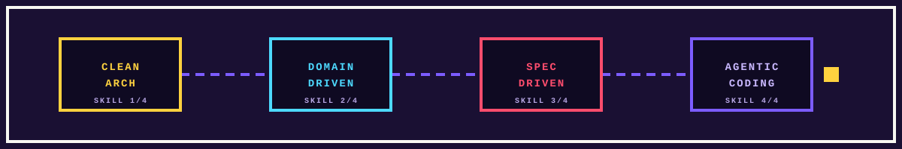

  

# JACOB HONG

**C# / .NET Developer** · 持續探索架構設計與 AI 協作開發

<samp>▶ BUILD. LEARN. LEVEL UP.</samp>

 

<a href="https://github.com/GUOJIE526/skills"><kbd>&nbsp;▶ OPEN SKILL INVENTORY&nbsp;</kbd></a>

 

## `▶ EQUIPMENT`

日常裝備。從應用邏輯到資料存取，一套組合打通全關卡。

| SLOT | ITEM | EFFECT |
| :--- | :--- | :--- |
| 主武器 | **`C#`** | 應用邏輯與語言核心 |
| 護甲 | **`ASP.NET Core`** | Web API 與服務層 |
| 飾品 | **`Entity Framework Core`** | 資料存取與模型對應 |
| 背包 | **`SQL Server`** | 資料儲存與查詢 |

 

## `▶ QUEST LOG`

 

| STATUS | QUEST | OBJECTIVE |
| :--- | :--- | :--- |
| `IN PROGRESS` | **Clean Architecture** | 職責邊界與依賴方向 |
| `IN PROGRESS` | **Domain-Driven Design** | 領域語言與業務模型 |
| `IN PROGRESS` | **Specification-Driven Development** | 從明確規格走向實作 |
| `IN PROGRESS` | **Agentic Coding** | 探索與 AI agents 協作的開發方式 |

 

<samp>▶ CONTINUE?　YES / NO</samp>

  

**MORE CURIOSITY. MORE CODE. MORE POWER.**

