<picture>
  <source media="(prefers-color-scheme: dark)" srcset="assets/hero-dark.svg">
  
</picture>

<br><br>

先理解流程、資料狀態與錯誤邊界，再進行設計與實作；重視資料一致、流程可靠、錯誤可追蹤與部署可控。

I work out the flow, the data states and the failure boundaries before I design or write code, and I care that data stays consistent, processes stay reliable, errors stay traceable and deployments stay controlled.

[hungkaojay@gmail.com](mailto:hungkaojay@gmail.com) · [個人介紹 About](https://guojie-hong.github.io/)

<br>

<h2><a href="https://github.com/GUOJIE-HONG/skills"><picture>
  <source media="(prefers-color-scheme: dark)" srcset="assets/heading-skills-dark.svg">
  
</picture></a></h2>

給 Claude Code、Codex 等 coding agent 用的 skill 套件，負責「寫程式之前」到「開始實作」這一段。所有 skill 共用同一條規則：**evidence, never guesswork**，每個結論都附上出處，沒有證據的就回報 unknown。

Agent skills for the stage before code is written and the first steps into it. Every claim carries a locator; anything not established is reported as unknown.

```text
/plugin marketplace add GUOJIE-HONG/skills
/plugin install guojie-skills@guojie-hong
```

或用 skills.sh 安裝 · or install with skills.sh:

```bash
npx skills@latest add GUOJIE-HONG/skills
```

需要先安裝 [mattpocock/skills](https://github.com/mattpocock/skills) · Requires Matt Pocock's skills.

| | 階段 Stage | skill |
| :-- | :-- | :-- |
| 1 | 找方向 Find a direction | `/dont-know-how` |
| 2 | 訪談定案 Interview and decide | `/grill-softly` · `/show-grill-clearly` · `torture-gently` |
| 3 | 選做法 Choose how to build | `/design-code-implement` |
| 4 | 實作 Implement | `/impl` · `/implement-all` |
| 5 | 小改與重構 Small changes and refactors | `/implement-small-change` · `/refactor` |
| 6 | 交接 Hand off to a new session | `/ptns` |

**[GUOJIE-HONG/skills](https://github.com/GUOJIE-HONG/skills)**

<br>

<h2><picture>
  <source media="(prefers-color-scheme: dark)" srcset="assets/heading-stack-dark.svg">
  
</picture></h2>

| 領域 Area | 工具 Tools |
| :-- | :-- |
| 語言與框架 Language and web | C# · ASP.NET Core MVC · ASP.NET Core Web API |
| 資料 Data | Entity Framework Core · LINQ · Dapper · SQL Server · MySQL |
| 排程與推播 Jobs and push | Hangfire · SignalR · Firebase Admin |
| 部署 Deploy | Azure · IIS · GitHub Actions |
| 前端協作 Frontend | Vue.js · Angular · jQuery |

<br>

<h2><picture>
  <source media="(prefers-color-scheme: dark)" srcset="assets/heading-studying-dark.svg">
  
</picture></h2>

| 主題 Topic | 方向 Focus |
| :-- | :-- |
| Clean Architecture | 職責邊界與依賴方向 |
| Domain-Driven Design | 領域語言與業務模型 |
| Specification-Driven Development | 從明確規格走向實作 |
| Agentic Coding | 探索與 AI agents 協作的開發方式 |

<br>

<h2><picture>
  <source media="(prefers-color-scheme: dark)" srcset="assets/heading-contact-dark.svg">
  
</picture></h2>

**Email** [hungkaojay@gmail.com](mailto:hungkaojay@gmail.com)
